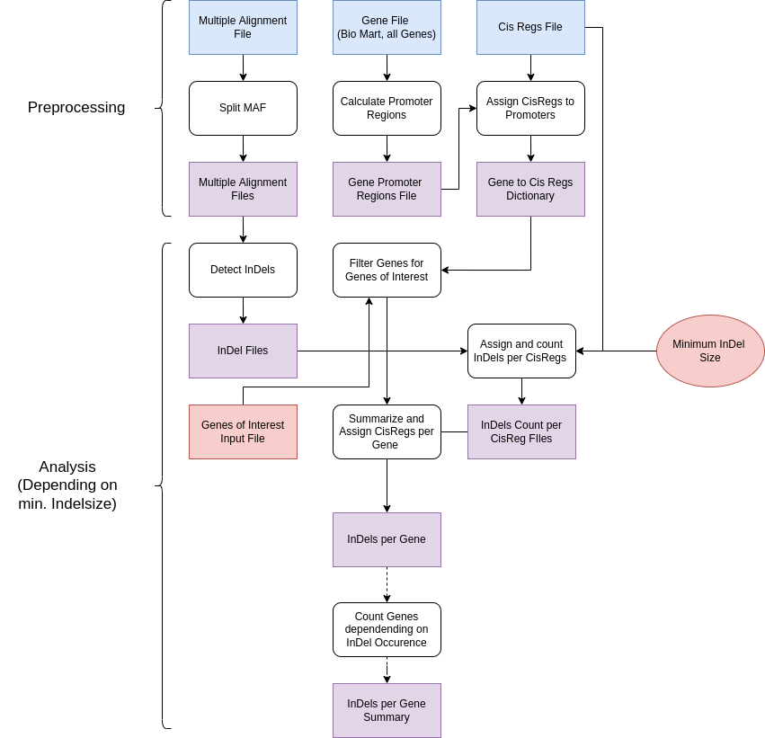

# MT CODE  V2

## Python dependencies:
Use python3 and install the dependencies preferably in a virtual environment.\
(pip install -r requirements.txt)\
Alternatively, use python virtual env:
/home/tlin/venv/

## Start analysis
In file_parameters.py edit the variable "run_name" to the InDel min length that you want to filter for.
Run the analysis with:

python run_streamlined_genome_analysis.py <INT>

INT = min InDel length

If you run the analysis pipeline for the first time you need to set needs_preprocessing = True (variables.py).

## Overview of the analysis:

